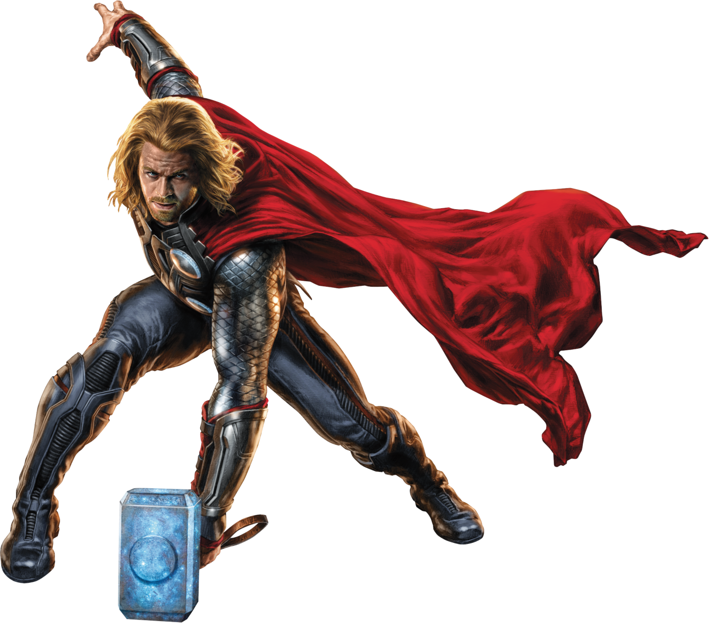

# Marvel x One Piece Dual-Fandom Portfolio

A **dual-fandom developer portfolio** that lets visitors switch between **Thor mode** (Asgardian dark cinematic) and **Gear 5 / Sun God Nika mode** (One Piece manga-comic). Same content, two universes — all driven by a Zustand store and Tailwind v4 theme tokens.

Originally crafted by [Dor Ben Tzur](https://github.com/dorbtz). MIT-licensed and built to be **forked** — every piece of personal identity (name, title, bio, socials, OG metadata) is wired through `VITE_PORTFOLIO_*` env vars. See [Customizing for your fork](#customizing-for-your-fork).

> **Live demo:** _coming soon_ — deploy URL will go here once the site is hosted.

## Table of Contents

- [Features](#features)
- [Screenshots](#screenshots)
- [Quick start](#quick-start)
- [Environment variables](#environment-variables)
- [Customizing for your fork](#customizing-for-your-fork)
- [Supabase setup](#supabase-setup)
- [Deployment](#deployment)
- [Architecture](#architecture)
- [Tech stack](#tech-stack)
- [Scripts](#scripts)
- [Security](#security)
- [Contributing](#contributing)
- [Credits](#credits)
- [License](#license)

## Features

- **Dual fandom modes** — Thor (Asgardian dark) ↔ Gear 5 / Luffy (manga-comic). Toggled in the header, persisted to localStorage, applied as `data-mode="thor|luffy"` on `<html>` synchronously on boot (no FOUC).
- **CMS-driven copy via Supabase** — Hero, About, Skills, Contact and Admin section content live in `site_content` rows, edited from the admin dashboard, falling back to in-code defaults when Supabase is unreachable.
- **Yggdrasil + Grand Line skill trees** — Mode-aware D3 hierarchy renders. Thor mode shows a tree of realms; Luffy mode shows the Grand Line islands with the Thousand Sunny tracking the user's progress.
- **Animated contact cards** — `HeimdallMedia` (Bifröst-watcher webm/png loop) and `DenDenLuffyMedia` (Den Den Mushi snail call) replace the previous R3F GLB scene, dramatically smaller and battery-friendly.
- **Hidden admin entry** — Click the word-initial letters of the wordmark in sequence within 1 s of each other to navigate to `/admin/login`. The sequence auto-derives from `VITE_PORTFOLIO_NAME` for forks (e.g. a three-word name produces a three-click sequence on its initial letters).
- **RLS-protected admin panel** — Magic-link auth (Supabase) plus a server-side `is_admin()` SECURITY INVOKER function gating every protected table. Allowlist is server-side; the client-side check in `adminAllowlist.ts` is a UX nicety, not the real gate.
- **GSAP-powered scroll FX** — ScrollTrigger pinned sections, marquees, and storm overlays. Lenis owns smooth scrolling (`scroll-behavior: smooth` is intentionally not used).
- **Dark + light themes per mode** — Each fandom has its own light/dark palette, again via Tailwind v4 `@theme` tokens.
- **Accessibility** — Skip links, sr-only headings, every decorative element marked `aria-hidden`, motion + sound respected via `prefers-reduced-motion` and the global toggle.

## Screenshots

| Thor mode (Asgardian dark) | Luffy / Gear 5 mode (manga) |
|---|---|
|  |  |

## Quick start

```bash
git clone <your-fork-url>
cd <your-fork-dir>
npm install
cp .env.example .env
# edit .env — at minimum set VITE_SUPABASE_URL, VITE_SUPABASE_ANON_KEY, and the VITE_PORTFOLIO_* block
npm run dev
```

Open http://localhost:5173. The site boots with placeholder text if `VITE_PORTFOLIO_NAME` etc. are unset — that's a hint to fill in `.env`.

## Environment variables

| Variable | Required | Default / fallback | Notes |
|---|---|---|---|
| `VITE_SUPABASE_URL` | yes | — | Your Supabase project URL (public). |
| `VITE_SUPABASE_ANON_KEY` | yes | — | Publishable anon key only. **Never** the service-role key. |
| `VITE_PORTFOLIO_NAME` | recommended | `"Your Name Here"` | Header wordmark, footer, and aria-labels. Word boundaries derive the hidden admin sequence (one click per word, on the word-initial letter). |
| `VITE_PORTFOLIO_TITLE` | recommended | `"Your Title"` | Tagline next to the name in the footer + sr-only h1 + page title. |
| `VITE_PORTFOLIO_BIO` | optional | `""` | One-sentence bio in the footer. Hidden if blank. |
| `VITE_PORTFOLIO_TAGLINE` | recommended | `""` | One-line meta description for SEO + OG/Twitter cards. |
| `VITE_PORTFOLIO_GITHUB_URL` | optional | `""` | Footer social icon. Hidden if blank. |
| `VITE_PORTFOLIO_LINKEDIN_URL` | optional | `""` | Footer social icon. Hidden if blank. |
| `VITE_GITHUB_USER` | optional | — | Username for the live GitHub stats badge in the header. |
| `VITE_GITHUB_BADGE_MODE` | optional | `live` | `live` (fetch from GitHub REST), `static` (hardcoded), or `off` (hide). |

`.env` is gitignored. The committed `.env.example` is the public schema; never put secrets there.

## Customizing for your fork

Three steps:

1. **Set portfolio identity in `.env`.** Copy `.env.example` to `.env`, fill in the `VITE_PORTFOLIO_*` block (and Supabase keys). The header, footer, page title, OG tags, and the hidden admin entry all follow automatically.
2. **Replace assets in `public/assets/`.** The Marvel-themed images live under `public/assets/Marvel/`, One-Piece-themed under `public/assets/One-Piece/`. Replace pixel-for-pixel or update the references in the affected components (`HeimdallMedia.tsx`, `DenDenLuffyMedia.tsx`, `Hero.tsx`).
3. **Seed your projects table.** Either run `supabase/seed/001_themed_projects.sql` and edit the owner UUID, or skip the seed and add projects from the admin dashboard (`/admin/projects`).

The footer carries a small `Originally crafted by Dor Ben Tzur ↗` watermark line — that's the attribution this template ships with. Forks may keep or remove it; the MIT license requires only attribution in the LICENSE file.

## Supabase setup

1. **Create a Supabase project** at https://supabase.com.
2. **Link the project locally** with the Supabase CLI:
   ```bash
   supabase link --project-ref <your-project-ref>
   ```
3. **Run migrations:**
   ```bash
   supabase db push
   ```
   (Or paste each `supabase/migrations/*.sql` into the Supabase SQL editor in order.)
4. **Seed the admin allowlist** with your email so the magic-link login lets you in:
   ```sql
   INSERT INTO public.admin_emails (email) VALUES ('you@example.com');
   ```
5. **(Optional) Seed projects** so the Projects page isn't empty before your first save:
   ```bash
   psql $SUPABASE_DB_URL -f supabase/seed/001_themed_projects.sql
   ```
6. **Copy the URL + anon key** from Project Settings → API into `.env`.

## Deployment

The site is a static Vite build that deploys to any static host:

- **Vercel / Netlify** — import the repo, set the same `VITE_*` env vars from `.env.example` in the dashboard. Build command: `npm run build`. Output dir: `dist`.
- **Cloudflare Pages** — identical setup.
- **Self-host** — `npm run build && npx serve dist`.

Set the Supabase project URL + anon key in the host's env panel — never commit `.env`.

## Architecture

Full deep-dive in [docs/ARCHITECTURE.md](./docs/ARCHITECTURE.md) — Feature-Sliced folder map, data flow, allowlist + RLS overview, bundle policy, per-round migration log.

One-paragraph version: the Zustand `mode` store is the single source of truth for Thor/Luffy + theme + sound + motion. It writes `data-mode` / `data-theme` to `<html>` synchronously on boot so CSS reacts without a React re-render. CMS copy lives in `site_content` keyed by section + mode; the `useSiteContent` hook merges live rows with in-code defaults so the site always has copy. Admin writes are gated server-side by `is_admin()` SECURITY INVOKER; client-side allowlist is UX-only.

## Tech stack

| Layer | Library |
|---|---|
| UI | React 19 + Vite (rolldown) + TypeScript |
| Styling | Tailwind v4 (CSS `@theme` tokens) |
| State | Zustand v5 with localStorage persist |
| Smooth scroll | Lenis + GSAP ticker sync |
| Animations | GSAP (ScrollTrigger, SplitText), `motion` |
| Audio | Howler 2 (lazy-loaded on first user gesture) |
| Search | Fuse.js |
| Diagram trees | d3-hierarchy + d3-shape |
| Database | Supabase (PostgreSQL + Storage + Auth) |
| Tests | Vitest + Testing Library |
| Lint | ESLint flat config + typescript-eslint |

> **Note:** `tailwind.config.js` is inert if present — Tailwind v4 reads tokens from `src/index.css` `@theme` block. Do not add tokens there.

> **Removed in Round 74:** React Three Fiber, drei, postprocessing, three.js, and `@lottiefiles/dotlottie-react`. The Heimdall + Den Den Mushi cards now use plain webm/png loops + GSAP. `node_modules` shrank by ~180 MB.

## Scripts

| Command | What it does |
|---|---|
| `npm run dev` | Start the dev server at http://localhost:5173 |
| `npm run build` | Type-check (`tsc -b`) and produce production bundle in `dist/` |
| `npm run preview` | Serve the production build locally |
| `npm run lint` | ESLint check (CI uses `--max-warnings 0`) |
| `npm test` | Vitest in watch mode |
| `npm test -- --run` | Vitest single-run (used by CI) |
| `npx tsc --noEmit` | Type-check only, no build |

## Security

All quick verifications a reviewer might want to confirm:

- **No secrets in git history.** `.env` is gitignored; only `.env.example` is tracked. The Supabase key in `.env` is the publishable anon key — never the service role key.
- **RLS on every protected table.** All migrations under `supabase/migrations/*.sql` enable RLS and define explicit policies.
- **Admin gate is server-side.** `public.is_admin()` is `SECURITY INVOKER`, called from RLS policies on every mutation. The client-side allowlist check (`src/lib/adminAllowlist.ts`) is purely a UX nicety to short-circuit obvious non-admins; bypassing it does not bypass the database.
- **`dangerouslySetInnerHTML` is safe.** Only used for static SVG path strings authored in source (`grandLineIslandShapes.ts`, `GrandLineMap.tsx`, `SkillsMapEditor.tsx`). No user input flows through it.
- **No service-role key in `src/`.** Confirm with `grep -rn "service_role" src/` (should return nothing).

## Contributing

PRs welcome. Before opening one:

1. `npm run lint` — must pass with zero warnings (CI gate).
2. `npm run typecheck` — must pass.
3. `npm test -- --run` — must pass.
4. `npm run build` — must succeed and stay under the CI bundle-size ceiling.

For larger changes (new sections, new admin pages, schema migrations), open an issue first so we can align on scope.

## Credits

- Originally crafted by [Dor Ben Tzur](https://github.com/dorbtz).
- Marvel and One Piece are trademarks of their respective owners; this template is fan-art and not affiliated with either franchise.
- Bangers, Bebas Neue, Special Elite, Noto Sans JP fonts via Google Fonts (SIL Open Font License).
- Elder Futhark rune labels for footer nav.

## License

MIT — see [LICENSE](./LICENSE).
